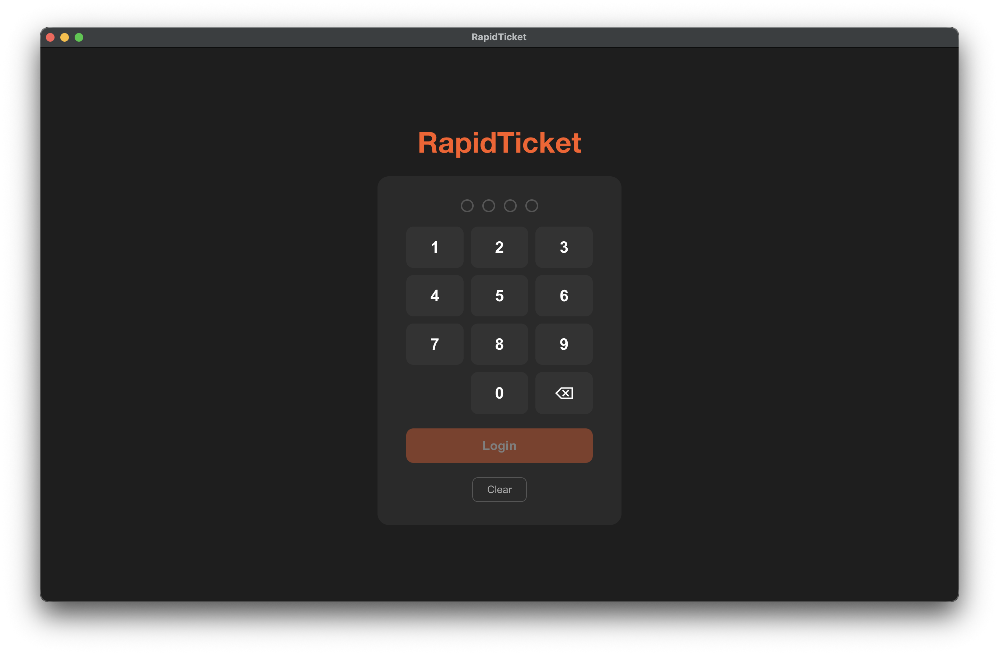
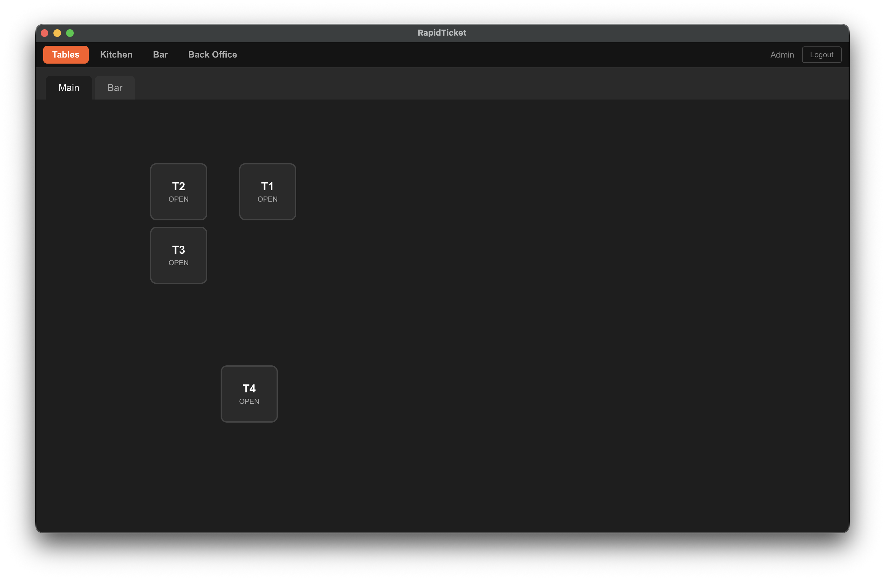
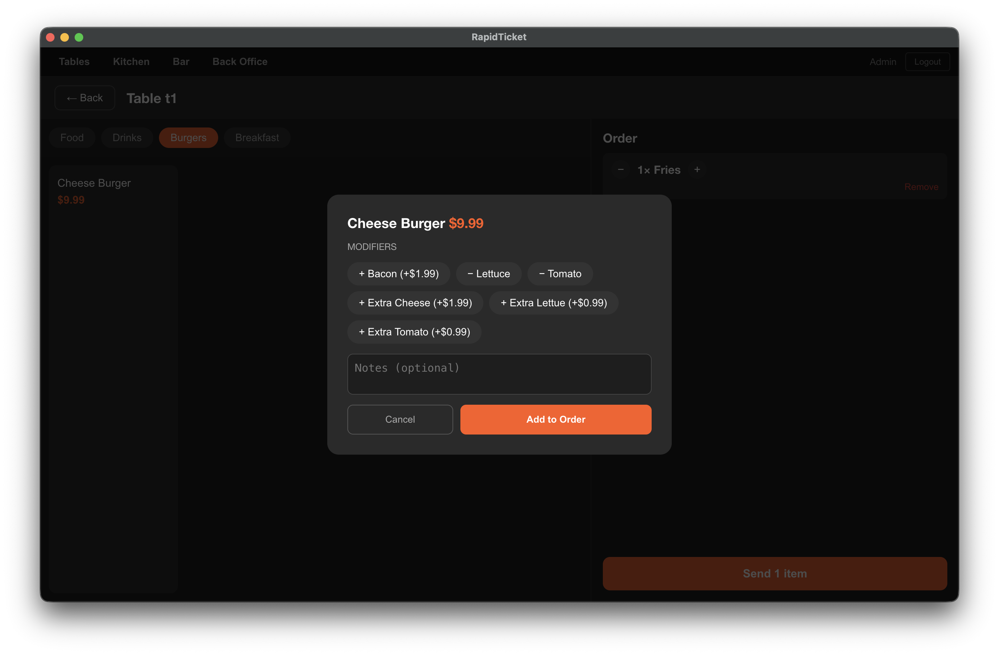
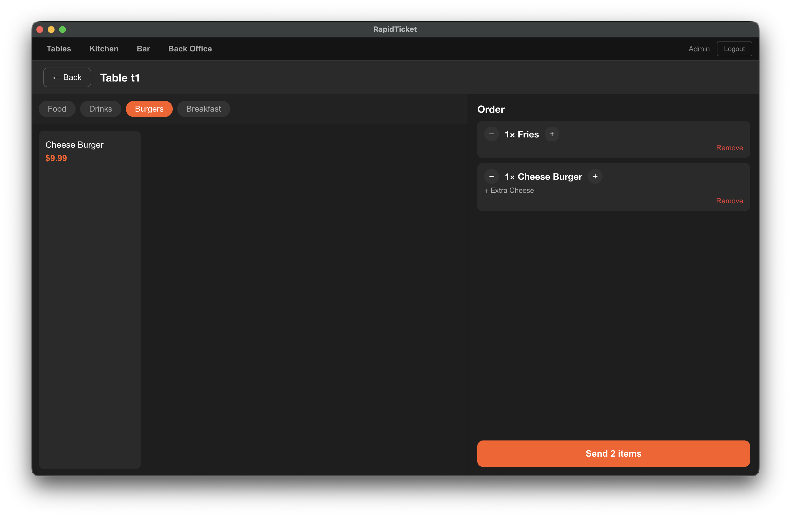
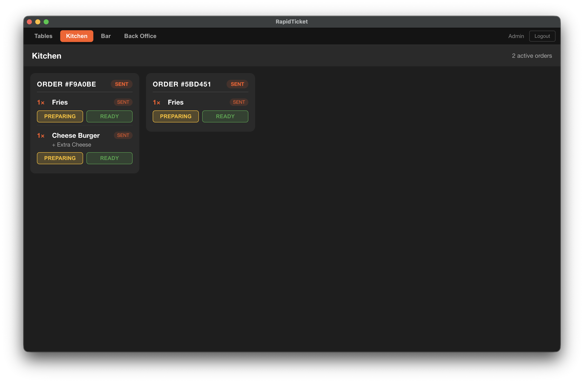
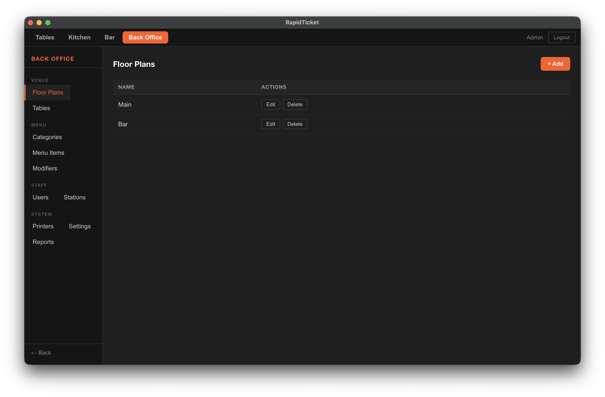

<div align="center">
  
  <h3>Speed at Every Table.</h3>
  <p>A LAN-only point-of-sale system for restaurants and bars.<br/>Runs entirely on your local network — no internet required.</p>
  <a href="LICENSE"></a>
</div>

---

## Screenshots

| Login | Table View | Order Screen |
|---|---|---|
|  |  |  |

| Table Items | Kitchen Screen | Back Office |
|---|---|---|
|  |  |  |

---

## Architecture

| Layer | Technology |
|---|---|
| Backend / API | NestJS (Node.js + TypeScript) |
| Database | PostgreSQL |
| Realtime | WebSocket (Socket.IO) |
| Client Stations | Electron (React + Vite) |
| Kitchen Printing | ESC/POS over Ethernet TCP (server-managed) |
| Station Printing | Locally attached printer via OS driver (client-managed) |

The server runs on one machine on the LAN. Any number of client stations (Electron desktop apps) connect to it over the local network via REST + WebSocket.

---

## Prerequisites

- **Node.js** 20+
- **PostgreSQL** 14+ running locally (default: `localhost:5432`)
- **npm** 9+ (workspaces support required)

---

## Database Setup

Create the database and user before first run:

```sql
CREATE USER rapidticket WITH PASSWORD 'rapidticket';
CREATE DATABASE rapidticket OWNER rapidticket;
```

Environment variables (all optional — defaults shown):

| Variable | Default |
|---|---|
| `DB_HOST` | `localhost` |
| `DB_PORT` | `5432` |
| `DB_USERNAME` | `rapidticket` |
| `DB_PASSWORD` | `rapidticket` |
| `DB_DATABASE` | `rapidticket` |

Migrations run automatically on server startup (`migrationsRun: true`).

---

## Running the Server

```bash
# Install dependencies (from repo root)
npm install

# Development (watch mode)
cd server
npm run start:dev

# Production
npm run start:prod
```

The server listens on port **3000** by default.

---

## Running the Client (Electron)

```bash
cd client
npm run electron:dev       # development — Vite + Electron
npm run electron:build     # package for distribution
```

---

## First Launch

### Station Setup Wizard
On the very first launch of a new station, a setup wizard will prompt for:
1. **Server URL** — LAN IP and port of the RapidTicket server (e.g. `http://192.168.1.10:3000`)
2. **Printer** — locally attached printer for bar chits and guest receipts (USB, Bluetooth, or None)

The station registers itself with the server automatically and stores a license token locally.

### Admin Account Creation
If no admin account exists on the server yet, the client will automatically show the **Create Admin Account** screen before the login page. Enter your name and a **4-digit PIN** (you will be prompted to confirm it). This creates the first administrator account and logs you in immediately.

Additional users can be managed in **Back Office → Users**.

---

## PIN Policy

All PINs are exactly **4 digits**. PINs are stored as bcrypt hashes (12 rounds) on the server — the plaintext PIN is never persisted.

Failed PIN attempts are tracked per station:

| Setting | Default | Description |
|---|---|---|
| `pin_lockout_threshold` | `5` | Failed attempts before station is locked |
| `pin_lockout_duration` | `300` | Lock duration in seconds (`0` = indefinite) |

Station lockouts are held in memory — they clear on server restart. Admins can also clear a lockout manually in **Back Office → Stations → Reset Lockout**.

---

## Settings Reference

Managed in **Back Office → Settings**.

| Key | Default | Description |
|---|---|---|
| `tax_rate` | `0.0875` | Sales tax rate (e.g. `0.0875` = 8.75%) |
| `auto_logout` | `true` | Log staff out after sending an order or completing a payment |
| `auto_logout_timeout` | `120` | Seconds of inactivity before auto-logout (`0` = disabled) |
| `pin_lockout_threshold` | `5` | Failed PIN attempts before station lockout |
| `pin_lockout_duration` | `300` | Lockout duration in seconds (`0` = indefinite) |

---

## Factory Reset

A **Factory Reset** wipes all users, orders, menu items, floor plans, stations, and printers, and restores settings to defaults. This is available in **Back Office → Settings → Danger Zone**.

Because this action is irreversible, it requires two confirmations:
1. A warning prompt asking you to acknowledge the consequences.
2. Your **admin PIN** — the reset will not proceed unless the correct PIN is entered.

---

## Print Routing

Each menu item has a `printDestination` configured in **Back Office → Menu**:

| Value | Behaviour |
|---|---|
| `KITCHEN` | Server sends an ESC/POS ticket via Ethernet TCP to the configured kitchen printer |
| `BAR` | Server emits a WebSocket event to the bar station; the bar station prints a chit on its local printer |
| `NONE` | No print action |

Guest receipts are always printed client-side from the station that processed the payment.

---

## Development Scripts (repo root)

```bash
npm run server:dev      # start server in watch mode
npm run server:build    # compile server TypeScript
npm run server:start    # run compiled server (production)
```

Manual migration commands (run from `/server`):

```bash
npm run migration:run       # apply pending migrations
npm run migration:revert    # revert last migration
npm run migration:generate  # generate a new migration from entity changes
```

---

## License

Distributed under the [Apache License 2.0](LICENSE).

